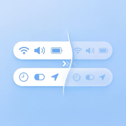

    
    <h1>Twice (the Ice)</h1>

Twice is a macOS menu bar manager for hiding, showing, and arranging menu bar items.

Twice is a fork of [Ice](https://github.com/jordanbaird/Ice) by [Jordan Baird](https://github.com/jordanbaird) (buy him a [coffee](https://www.buymeacoffee.com/jordanbaird)). The original appears to be abandoned and was failing on newer macOS releases, so I made some fixes because I wanted to keep using it. No guarantees about its future, but for now, it works.

## Install

Download the "Twice.zip" file from the [latest release](https://github.com/kempu/Twice/releases/latest) and move the unzipped app into your `Applications` folder.

## License

Twice is available under the [GPL-3.0 license](LICENSE).
